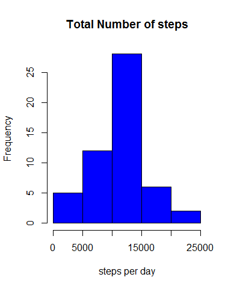
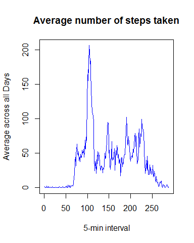
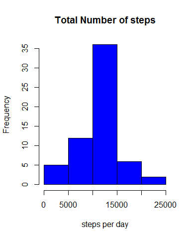
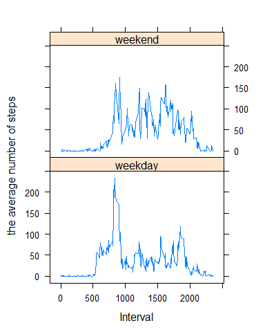

# Reproducible Research Peer Assessment 1
CYYin  
December 21, 2015  
# Introduction

This assignment makes use of data from a personal activity monitoring device. This device collects data at 5 minute intervals through out the day. The data consists of two months of data from an anonymous individual collected during the months of October and November, 2012 and include the number of steps taken in 5 minute intervals each day.

# Data
The variables included in this dataset are:

-steps: Number of steps taking in a 5-minute interval (missing values are coded as NA)

-date: The date on which the measurement was taken in YYYY-MM-DD format

-interval: Identifier for the 5-minute interval in which measurement was taken

The dataset is stored in a comma-separated-value (CSV) file and there are a total of 17,568 observations in this dataset.

## Loading and preprocessing the data

### 1.1 Load the data


```r
activity <- read.csv("activity.csv", colClasses = c("numeric", "character", "numeric"))
head(activity)
```

```
##   steps       date interval
## 1    NA 2012-10-01        0
## 2    NA 2012-10-01        5
## 3    NA 2012-10-01       10
## 4    NA 2012-10-01       15
## 5    NA 2012-10-01       20
## 6    NA 2012-10-01       25
```

### 1.2 Process/transform the data


```r
activity$date <- as.Date(activity$date, "%Y-%m-%d")
```

## What is mean total number of steps taken per day?

### 2.1 Calculate the total number of steps taken per day


```r
TotalStepsSum <- aggregate(steps ~ date, data = activity, sum, na.rm = TRUE)
```

### 2.2 Make a histogram of the total number of steps taken each day


```r
hist(TotalStepsSum$steps,col ="blue", main = "Total Number of steps",xlab ="steps per day")
```

 

### 2.3 Calculate and report the mean and median of the total number of steps taken per day


```r
TotalStepmean <- mean(TotalStepsSum$steps)
TotalStepmedian <- median(TotalStepsSum$steps)
```

the mean is

```
## [1] 10766.19
```

the median is

```
## [1] 10765
```

## What is the average daily activity pattern?

### 3.1 Make a time series plot 


```r
timepattern<- tapply(activity$steps, activity$interval, mean, na.rm = TRUE)
plot(timepattern, type = "l", xlab = "5-min interval", 
     ylab = "Average across all Days", main = "Average number of steps taken", 
     col = "blue")
```

 

### 3.2 Find the maximum number of steps


```r
maxsteps<- which.max(timepattern)
```

the maximum number of steps is

```
## [1] "835"
```

## Imputing missing values

### 4.1 Calculate and report the total number of missing values in the dataset


```r
missingNum <- sum(is.na(activity))
```

the total number of missing values is

```
## [1] 2304
```

### 4.2 Devise a strategy for filling in all of the missing values in the dataset.


```r
activityDataxNA <- activity
NAID <- which(is.na(activity$steps))
```

### 4.3 Create a new dataset that is equal to the original dataset but with the missing data filled in.


```r
fillin<- rep(mean(activityDataxNA$steps, na.rm=TRUE), times=length(NAID))
activityDataxNA[NAID, "steps"] <- fillin
TotalStepsSumxNA <- aggregate(steps ~ date, data = activityDataxNA, sum, na.rm = TRUE)
```

### 4.4 Make a histogram of the total number of steps taken each day and Calculate and report the mean and median total number of steps taken per day.


```r
hist(TotalStepsSumxNA$steps,col ="blue", main = "Total Number of steps",xlab ="steps per day")
```

 


```r
TotalStepxNAmean <- mean(TotalStepsSumxNA$steps)
TotalStepxNAmedian <- median(TotalStepsSumxNA$steps)
```

the mean is

```
## [1] 10766.19
```

the median is

```
## [1] 10766.19
```

## Are there differences in activity patterns between weekdays and weekends?
### 5.1 Create a new factor variable in the dataset with two levels – “weekday” and “weekend” 


```r
activity$daytype <- weekdays(as.Date(activity$date))
activity$daylevel <-ifelse(activity$daytype == "Saturday" | activity$daytype == "Sunday", "weekend", "weekday")
```

### 5.2 Make a panel plot containing a time series plot of the 5-minute 
###     interval (x-axis) and the average number of steps taken, 
###     averaged across all weekday days or weekend days (y-axis).


```r
dayleveldiff<- aggregate(steps ~ interval + daylevel, data = activity, mean, na.rm = TRUE)
library(lattice)
xyplot(steps ~ interval | daylevel, dayleveldiff, type = "l", layout = c(1, 2), 
       xlab = "Interval", ylab = "the average number of steps ")
```

 
